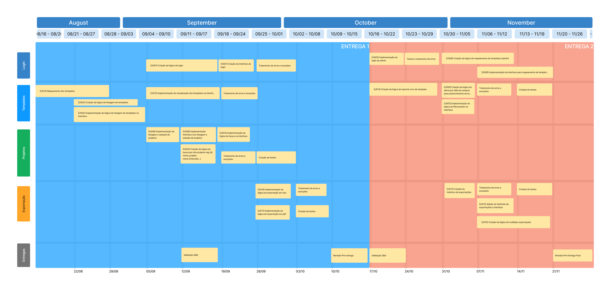

# RoadMap

## Introdução
Um roadmap é um plano estratégico visual que delineia os principais marcos, metas e direções de um projeto, produto ou iniciativa ao longo do tempo. Ele serve como um guia para o desenvolvimento, ajudando a equipe a compreender o cronograma e as prioridades. O roadmap geralmente inclui datas estimadas para entregas importantes e destaca os passos necessários para atingir os objetivos desejados. Ao fornecer uma visão panorâmica, o roadmap facilita a comunicação entre as partes interessadas e auxilia na tomada de decisões informadas para alcançar com sucesso os resultados desejados.

## O RoadMap

Por meio da realização de diversar reuniões com os Stakeholders, o RoadMap presente na Figura 1 foi formulado. Apresentando as principais tarefas a serem realizadas, nosso roadmap é particionado por quatro temáticas relacionadas ao desenvolvimento, mostrando cadas aspecto a ser implementado de acordo com as histórias de usuário elicitadas, e uma seção de Entregas, elencando os principais momentos de preparação, validação e entrega com os stakeholders.  

Figura 1 - (Autor: Pedro Barbosa)

> Obs.: o RoadMap foi produzido de acordo com a versão 1.0 do documento de história de usuários, e priorizado de acordo com conversar com os stakeholders. Com isso, há a possibilidade de alterações pontuais ao longo do desenvolvimento.

## Histórico de versão
| Data | Versão | Descrição | Autor | Revisor | Issue |
| --- | --- | --- | --- | --- | --- |
| 16/08/2023 | 1.0 | Criação do documento | [Pedro](https://github.com/pedrobarbosaocb) | [Raquel](https://github.com/raqueleucaria) | [#37](https://github.com/ResidenciaTICBrisa/05_PipelineFinatec/issues/37) |

